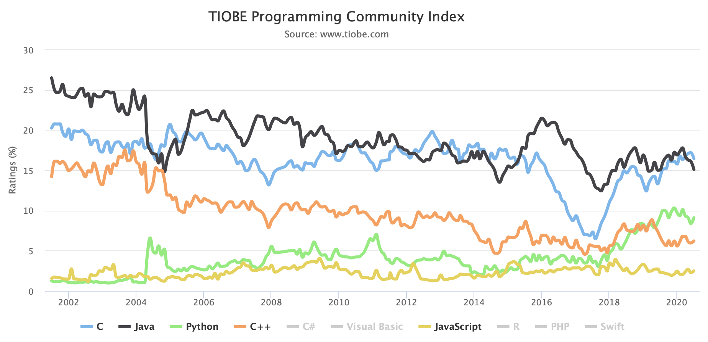
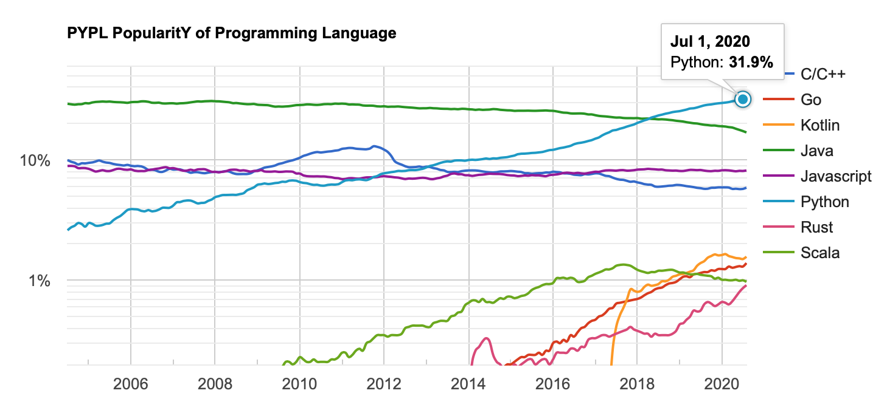

# python_setup

## language popularity

Tiobe Index

PYPL Index

## Enterprise Language Features Needed
1. web application
2. distributed service
3. messaging
4. remoting
    - http
    - email
5. data storage and persistence 
    - database
    - distributed file system
6. documents
    - office documents
        - word
        - excel
        - powerpoint
    - pdf
7. security
    - authentication
    - authorization
    
## inter-language communication
- py4j
- rpy2
- pythonnet

[Python Installation](python_installation.md)  
[Python Build](python_build.md)