# Set up IntelliJ Projects

We choose IntelliJ here, but PyCharm is similar. It's a great refactoring tool.
When I move HTML/Markdown files, IntelliJ maintains the references. When I move
code to different packages, IntelliJ moves the references as well. It's more
than a coding tool.

## Python Plugin
First, download Python plugin for IntelliJ. Go to Settings from File menu
(Windows) or Preferences(Mac), then click Plugins on the left. Find the Python
plugin and install it.

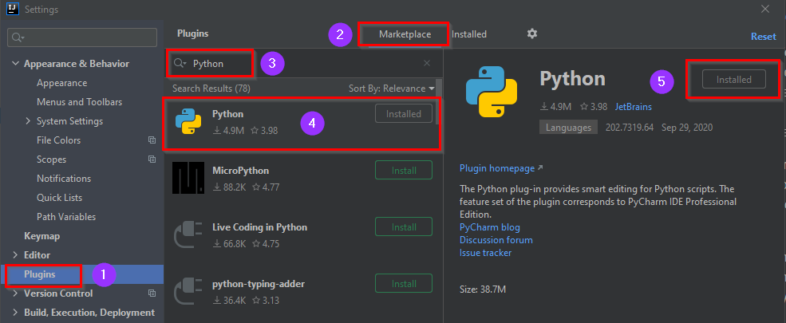

## Project Setup
When we create new project, we have to deal with 2 major steps:
- activate Python plugin
- put all IntelliJ files in a folder so that it won't "pollute" the project 
folder.

Go to File | New | Project, selection Python from the left side and pick a 
Python SDK on the top

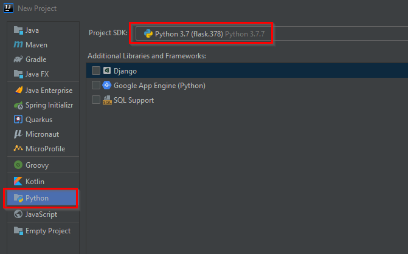

Without going through this step, the Python plugin won't be activated and
subsequently there is no Python SDK option later in the project dialog.

In the next step, select the project folder and modify the defaults with a new
folder (I use IDE as the folder name) where we store IntelliJ files. The upper
settings are for project files, the lower settings are for module settings.

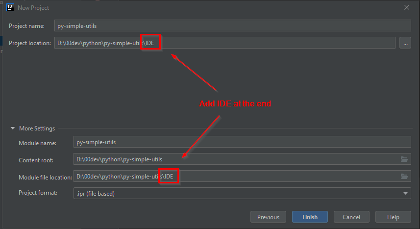

After finished, we should see the following file structure

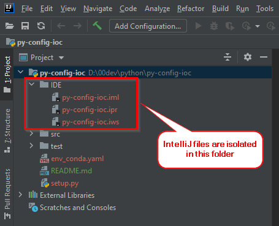

One extra step we should do is to hide unneeded folders. Right mouse click the
project (topmost) and select Open Module Settings. We may exclude IDE folder
and other build folders generated from setup.py.

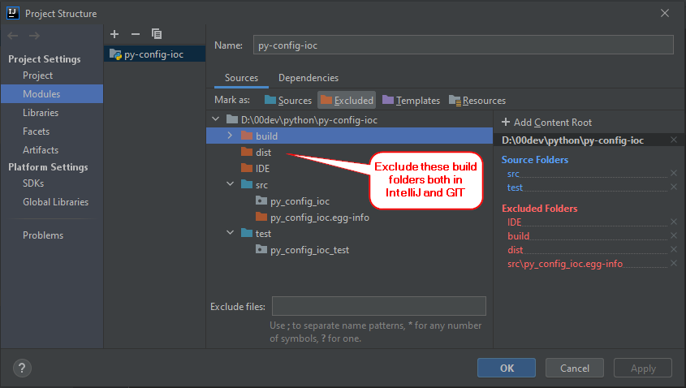

Set up project Python SDK first so
that all modules can reference project Python SDK.

If we need more modules, set the module file location to the IDE folder as
well during module setup.

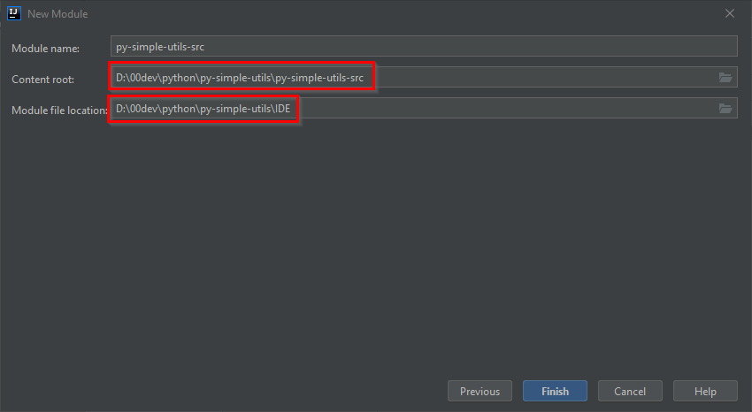

Setup the source folder in each module(marked as blue color).

If a package appears in 2 source folders(source or test), only 1 will be effective.
So the root package name in the test folder has to be different from the root
package name in the source folder. One convention is to add _test at the end in
the test package.

## Runtime Setup
To run Python code, right mouse click anywhere in the Python file, the context
menu shows several options:

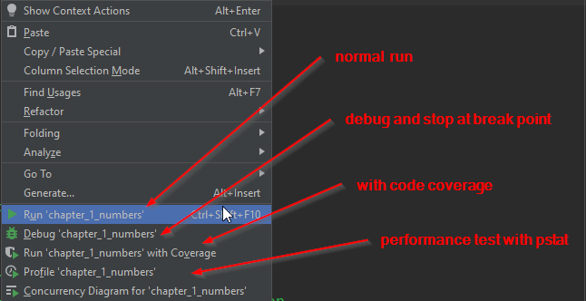

Other settings can be found in the Run Configuration

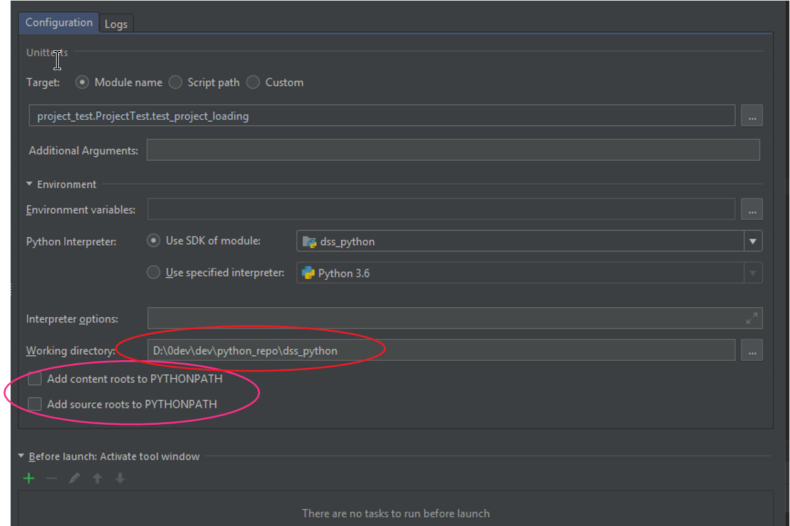

Python has several testing frameworks, you may choose from preferences/settings:

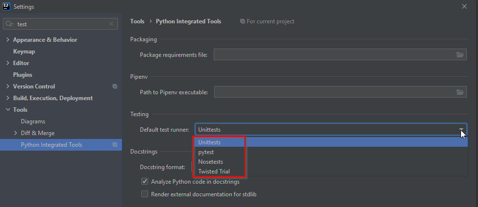

To set up test coverage, configure the following in preferences/settings:

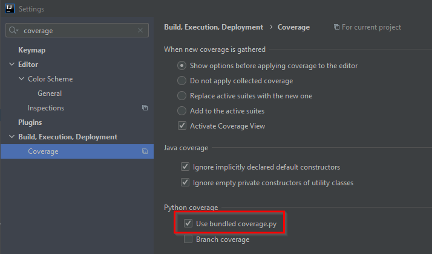

The unit test context menu is similar to the above

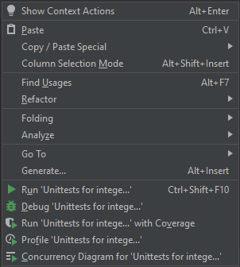

test background color: 3C3F41

## GIT repository

Ignore the following in GIT:  
__pycache__  
.coverage  
/src/*.egg-info  
/build  
/dist  

IntelliJ has GIT functionalities built in. On windows, TortoiseGIT is a nice
GUI. Another tool for github is: https://desktop.github.com/.

Command line tool is for more experienced users.

## Other Plugins
IntelliJ is very versatile, with plugins. I have the following, for example,

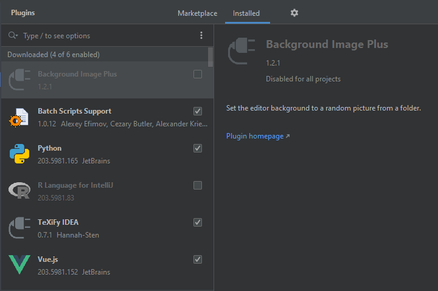
