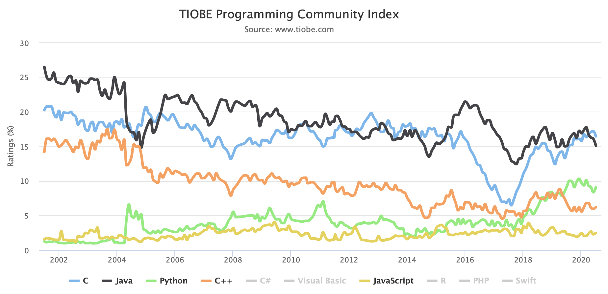
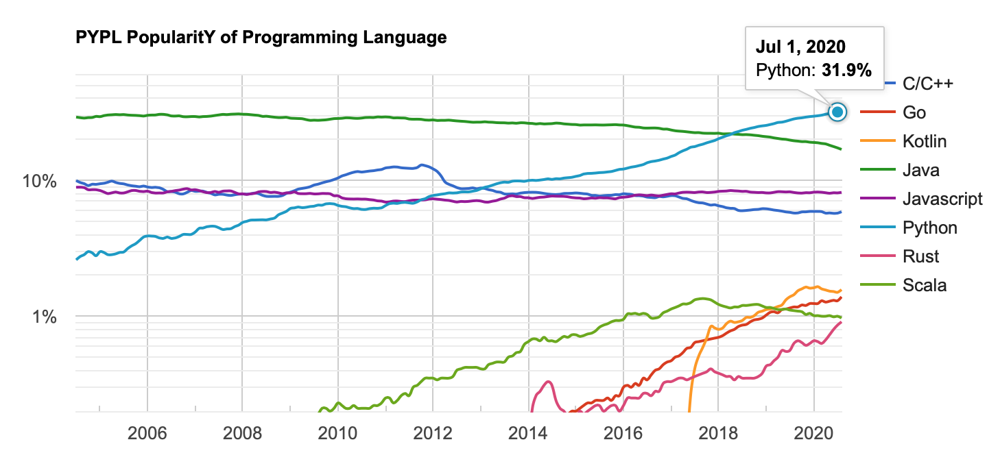

 
### Why we pick Python
I've used Java, Scala, Kotlin, C#, Python, javascript, and others. Python is
one of the languages with the lowest learning curve. Its form is close to 
English and the logic is close to human thinking style. So first time users
accept it in a less hassle way. Python is a language that is easy to get
familiar with but hard to be an expert(because of the vast libraries).

On the other hand, Python is very powerful with a lot of extended 3rd party
libraries. At a certain time in the history, there is not enough libraries to
build enterprise applications in an easy or standard way. However, now Python
ecosystem is much better than before. It can serve the daily work and more.

The following charts/snapshots shows the growing popularity over the history. 
In the past 30 years, C/C++ and Java are the main players. C/C++ are used 
mainly for performance reason. Java is used mainly for its vast industrial 
standards, such as JDBC/JTA, JMS, etc. Spring framework plays a major role 
for populating Java. Python is getting more and more popular in recent years
because of the AI deep learning advance, especially Tensorflow library 
published. 

**Tiobe Index**

**PYPL Index**

**Redmonk Index**

[Thoughworks](https://www.thoughtworks.com/radar/languages-and-frameworks/python-3)
indicates mainstream adoption in 2017.

Another trending site is: 
https://trends.google.com/trends/explore?geo=US&q=%2Fm%2F05z1_,%2Fm%2F07sbkfb,%2Fm%2F0jgqg  
This site can be used to compare many tools, e.g.,  
https://trends.google.com/trends/explore?geo=US&q=%2Fm%2F0289_xs,pyodbc

Arguably, we predict Python will be the language for the next decade with
80/20 rule applied. 80% of the easy workload will be done by Python, while the
20% load will be done in C/C++/others. UI/UX will be likely dominated by
javascript/css. Java will be faded away for several reasons. First, if Python
can do the job and can do more with AI and can do it faster, there is a force
to push the change, especially in colleges. Secondly, Kotlin is cutting into
the way. If there is an easier way to do it, it's just a matter of time to go
down that way.

R is the best ecosystem in statistics. However, R is not designed to be a
general enterprise application foundation. So it's not under consideration.
We try to find a general language that could fulfill the majority need for
enterprise applications in a fast pace. We are looking for a tool so that 
we do less for more with it.

### Enterprise Language Features Needed
Here are the minimal set of features for enterprise applications(server side):
1. web application framework
2. distributed/parallel computing services
3. messaging for async communication
4. data storage and persistence 
    - databases/transactions
    - caches
    - indexers
    - distributed file systems
5. documents
    - office documents
        - word
        - excel
        - powerpoint
    - pdf
6. security
    - authentication
    - authorization
    
We need a platform of reused libraries so that we don't need to write 
our own customized versions. Back 10 years, we missed some the of essential
libraries, or some of them were not matured enough. 
    
### Inter-Language Communication
If other languages have some unique and nice libraries, or Python does not have
similar libraries, then we can access via these libraries. 
- py4j
- rpy2
- pythonnet

In addition, Python has close relations with C/C++ via Cython/SWIG. If any
block of Python script is slow, we can rewrite it in C/C++ and wrap it in.

May the force be with you and remember that teamwork is more effective and
efficient.

